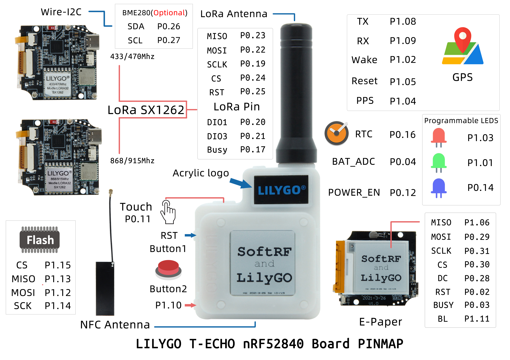

<h1 align = "center">🌟LilyGo T-ECHO🌟</h1>

## **English | [中文](docs/docs_cn.md)**

## Using Arduino IDE

1. Download [Arduino IDE](https://www.arduino.cc/en/software)

2. Open Arduino, open preferences-> add https://adafruit.github.io/arduino-board-index/package_adafruit_index.json to the board installation manager address list

3. Open the board installation manager, wait for the index update to complete, select 'Adafruit nRF52 by Adafruit' and click install

4. After the installation is complete, select 'Nordic nRF52840(PCA10056)' in the board list

5. Copy all the folders in the lib directory to `"C:\User\<YourName>\Documents\Arduino\libraries"`

6. Open the sketch => tool => port, select the port of the connected board, and click upload

## Using PlatformIO

1. Install [VSCODE](https://code.visualstudio.com/) and [Python](https://www.python.org/)

2. Search for the PlatformIO plug-in in the VSCODE extension and install it.

3. After the installation is complete and the reload is completed, there will be a small house icon in the lower left corner. Click to display the Platformio IDE home page

4. Go to file - > Open folder - > Select the LilyGO-T-ECHO folder and click the (√) symbol in the lower left corner to compile (→) for upload.

5. If you use USB to download the firmware (platformio.ini upload_protocol = nrfutil), you need to double-click reset button to enter DFU mode before downloading

## Product 📷

|  Product   |                                                                                                Product  Link                                                                                                 |
| :--------: | :----------------------------------------------------------------------------------------------------------------------------------------------------------------------------------------------------------: |
| [T-Echo]() | [AliExpress](https://pt.aliexpress.com/item/1005002842456390.html)/[Amazon](https://www.amazon.com/dp/B0B659536P?ref=myi_title_dp)/[Tindie](https://www.tindie.com/products/lilygo/lilygo-t-echo-nrf52840/) |

## PinOut



## Application

- [T-Echo SoftRF](https://github.com/lyusupov/SoftRF/wiki/Badge-Edition)

- [T-Echo Meshtastic](https://github.com/meshtastic/Meshtastic-device/releases)

## Precautions

1. Need to use the files in the **lib** directory, it includes:

    - [`arduino-lmic`](https://github.com/mcci-catena/arduino-lmic)

    - [`AceButton`](https://github.com/bxparks/AceButton)

    - [`Adafruit_BME280_Library`](https://github.com/adafruit/Adafruit_BME280_Library)

    - [`Adafruit_BusIO`](https://github.com/adafruit/Adafruit_BusIO)

    - [`Adafruit_EPD`](https://github.com/adafruit/Adafruit_EPD)

    - [`Adafruit-GFX-Library`](https://github.com/adafruit/Adafruit-GFX-Library)

    - [`Button2`](https://github.com/LennartHennigs/Button2.git)

    - [`GxEPD`](https://github.com/ZinggJM/GxEPD.git)

    - [`PCF8563_Library`](https://github.com/lewisxhe/PCF8563_Library.git)

    - [`RadioLib`](https://github.com/jgromes/RadioLib)

    - [`SerialFlash`](https://github.com/PaulStoffregen/SerialFlash)

    - [`SoftSPI`](https://github.com/MajenkoLibraries/SoftSPI.git)

    - [`TinyGPSPlus`](https://github.com/mikalhart/TinyGPSPlus.git)

2. Pins on boards are not compatible with the official SDK.If you want to use the SDK, pay special attention to the pin definition.

3. Use [Adafruit_nRF52_Arduino](https://github.com/adafruit/Adafruit_nRF52_Arduino) by default, so [Adafruit_nRF52_Bootloader](https://github.com/adafruit/Adafruit_nRF52_Bootloader) has been burned in the factory, if you use **nRF5-SDK** Programming the board will lose the original bootloader

4. If you need to use **nRF5-SDK** for programming, please click the link to download [**nRF5-SDK**](https://www.nordicsemi.com/Software-and-Tools/Software/nRF5-SDK/Download)

5. **NFC Function** is not supported in **Adafruit_nRF52_Arduino**, please use [**nRF5-SDK**](https://www.nordicsemi.com/Software-and-Tools/Software/nRF5-SDK/Download) for programming

6. Flash will choose MX25R1635FZUIL0 or ZD25WQ16B according to the availability.Pay attention to the difference when using.

7. If you need to burn a new bootloader, see [Burning a new bootloader](bootloader/README.MD)

## Battery life

Current consumption from 3.7 Volt battery:

|         Mode         | Average current |
| :------------------: | :-------------: |
| Active backlight OFF |      42 mA      |
| Active backlight ON  |      55 mA      |
|        Sleep         |     0.25 mA     |

Operating time from a full charge depends on your actual battery capacity.


## Announcements :

1. After setting the LoRa output power, set the lowest current. Set sx1262 as follows :

```
    // digitalWrite(LoRa_Busy, LOW);
    // set output power to 10 dBm (accepted range is -17 - 22 dBm)
    if (radio.setOutputPower(22) == RADIOLIB_ERR_INVALID_OUTPUT_POWER) {
        Serial.println(F("Selected output power is invalid for this module!"));
        while (true);
    }


    // set over current protection limit to 80 mA (accepted range is 45 - 240 mA)
    // NOTE: set value to 0 to disable overcurrent protection
    if (radio.setCurrentLimit(80) == RADIOLIB_ERR_INVALID_CURRENT_LIMIT) {
        Serial.println(F("Selected current limit is invalid for this module!"));
        while (true);
    }
```