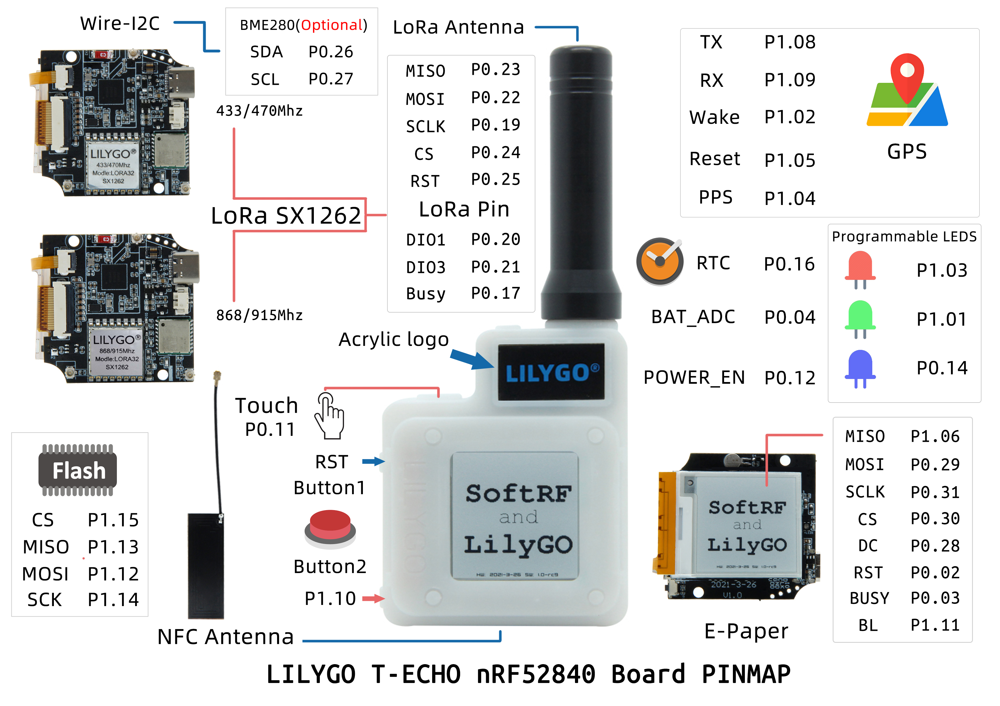
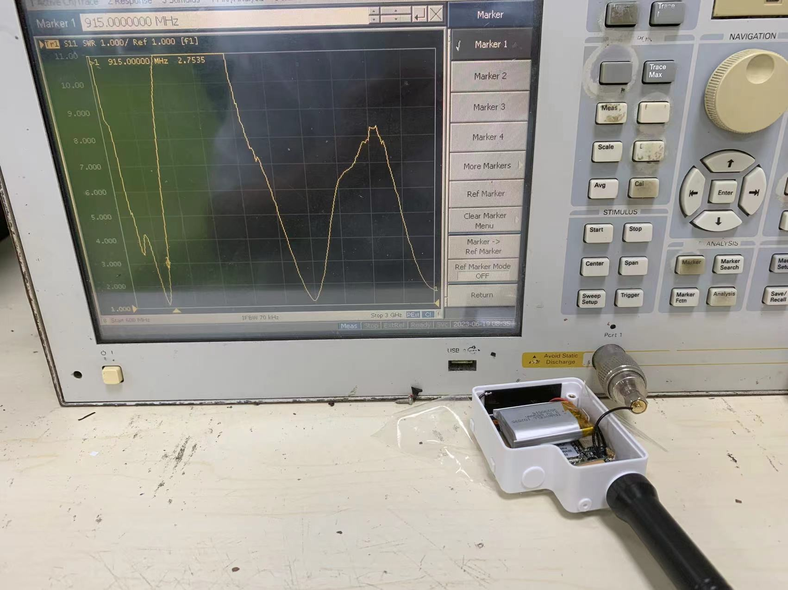
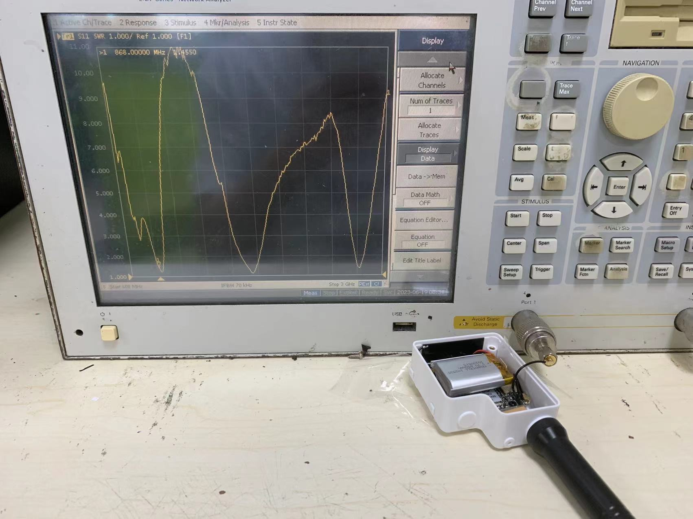
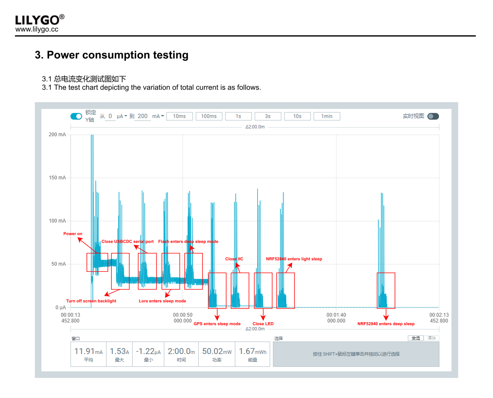

<div align="center" markdown="1">
  
</div>

<h1 align = "center">🌟 LilyGo T-Echo 🌟</h1>


## 📖 Table of Contents

- [📖 Table of Contents](#-table-of-contents)
- [📋 Product](#-product)
- [🚀 Quick Start](#-quick-start)
  - [Arduino IDE Quick Start](#arduino-ide-quick-start)
  - [PlatformIO Quick Start](#platformio-quick-start)
- [📷 Product](#-product-1)
- [💾 Flash Factory Firmware](#-flash-factory-firmware)
- [🔧 Hardware Description](#-hardware-description)
  - [T-echo pinout](#t-echo-pinout)
  - [T-echo Plus Back panel](#t-echo-plus-back-panel)
  - [✨ Display Features](#-display-features)
  - [🧑🏼‍🔧 I2C Devices Address](#-i2c-devices-address)
  - [⚡ Electrical Parameters](#-electrical-parameters)
  - [💡 LED](#-led)
    - [Charger LED Status](#charger-led-status)
  - [⏺︎ Button](#︎-button)
- [📡 Antenna Actual Test Reference](#-antenna-actual-test-reference)
- [📄 Datasheet](#-datasheet)
- [📐 Case \& Dimensions](#-case--dimensions)
- [📱 Application](#-application)
- [⚠️ Precautions](#️-precautions)
- [🔋 Battery Life](#-battery-life)
- [📝 Announcements](#-announcements)

---

## 📋 Product

|     Product      |                          Difference                           |
| :--------------: | :-----------------------------------------------------------: |
|   [T-Echo][1]    |                   Battery Capacity  850mAh                    |
| [T-Echo Plus][7] | Battery Capacity 2400mAh + BHI260 Smart IMU + Haptic + Buzzer |

[1]: https://lilygo.cc/products/t-echo-lilygo
[7]: https://lilygo.cc/products/t-echo-plus

---

## 🚀 Quick Start

### Arduino IDE Quick Start

1. Install [Arduino IDE](https://www.arduino.cc/en/software)
2. Open Arduino, add the following URL to Preferences → `Additional boards manager URLs`:
   ```txt
   https://adafruit.github.io/arduino-board-index/package_adafruit_index.json
   ```
3. Open the Board Manager, wait for the index update to complete, select **Adafruit nRF52 by Adafruit** and click Install
4. After installation is complete, select **Nordic nRF52840 (PCA10056)** or **Nordic nRF52840 DK** from the board list
5. Copy all folders from the [lib](./lib/) directory to your Arduino libraries directory (e.g., `C:\Users\YourName\Documents\Arduino\libraries`)
6. Double-click the button on the upper left to put the device into DFU mode. When you see the computer eject a disk, you have successfully entered DFU mode.
7. Open your sketch, go to **Tools → Port**, select the port of the connected board, and click Upload

### PlatformIO Quick Start

1. Install [Visual Studio Code](https://code.visualstudio.com/) and [Python](https://www.python.org/)
2. Search for the `PlatformIO` plugin in Visual Studio Code extension marketplace and install it
3. Restart Visual Studio Code after installation. A small house icon will appear in the bottom-left corner
4. Go to `File` → `Open Folder` → select the `LilyGO-T-ECHO` folder
5. Double-click the button on the upper left to put the device into DFU mode. When you see the computer eject a disk, you have successfully entered DFU mode.
6. Click the (✔) icon in the bottom-left corner to compile, click (→) to upload
7. If using USB to download firmware (`platformio.ini upload_protocol = nrfutil`), double-click the reset button to enter DFU mode before downloading

---

## 📷 Product



> **Note:** Please see the list below for the complete pinout.

---

## 💾 Flash Factory Firmware

If you need to restore the factory firmware or flash the UnitTest firmware for hardware testing, please refer to the [Firmware Flashing Guide](./firmware/README.MD).

## 🔧 Hardware Description

### T-echo pinout

| Name                 | Chip pin number | Arduino pin number | Note                                              |
| -------------------- | --------------- | ------------------ | ------------------------------------------------- |
| Display              | Display         | Display            | Display                                           |
| Display MOSI         | P1.6            | 36                 |                                                   |
| Display MISO         | P0.29           | 29                 |                                                   |
| Display SCLK         | P0.31           | 31                 |                                                   |
| Display BUSY         | P0.3            | 3                  |                                                   |
| Display DC           | P0.28           | 28                 |                                                   |
| Display CS           | P0.30           | 30                 |                                                   |
| Display RST          | P0.2            | 2                  |                                                   |
| Display backlight    | P1.11           | 43                 |                                                   |
| LoRa                 | LoRa            | LoRa               | LoRa                                              |
| LoRa MOSI            | P0.22           | 22                 |                                                   |
| LoRa MISO            | P0.23           | 23                 |                                                   |
| LoRa SCLK            | P0.19           | 19                 |                                                   |
| LoRa BUSY            | P0.17           | 17                 |                                                   |
| LoRa CS              | P0.24           | 24                 |                                                   |
| LoRa RST             | P0.25           | 25                 |                                                   |
| LoRa DIO0            | P0.22           | 22                 |                                                   |
| LoRa DIO1            | P0.20           | 20                 |                                                   |
| LoRa DIO3            | P0.21           | 21                 |                                                   |
| GPS                  | GPS             | GPS                | GPS                                               |
| [GPS L76K][8] TX     | P1.8            | 40                 |                                                   |
| [GPS L76K][8] RX     | P1.9            | 41                 |                                                   |
| [GPS L76K][8] PPS    | P1.4            | 36                 |                                                   |
| [GPS L76K][8] Wakeup | P1.2            | 34                 |                                                   |
| [GPS L76K][8] RESET  | P1.5            | 37                 |                                                   |
| LED                  | LED             | LED                | LED                                               |
| Red LED              | P1.3            | 35                 |                                                   |
| Blue LED             | P0.14           | 14                 |                                                   |
| Green LED            | P1.1            | 33                 |                                                   |
| BUTTON               | BUTTON          | BUTTON             | BUTTON                                            |
| RESET                | P0.18           | 18                 | Reset device, cannot be used for other functions. |
| User Button          | P1.10           | 42                 | Low level active                                  |
| FLASH                | FLASH           | FLASH              | FLASH                                             |
| QSPI SCLK            | P1.14           | 46                 | SPI SCK                                           |
| QSPI CS              | P1.15           | 47                 | SPI CS                                            |
| QSPI IO0             | P1.12           | 44                 | SPI MOSI                                          |
| QSPI IO1             | P1.13           | 45                 | SPI MISO                                          |
| QSPI IO2             | P0.7            | 7                  | SPI NC                                            |
| QSPI IO3             | P0.5            | 5                  | SPI NC                                            |
| Touch Button         | P0.11           | 11                 | High level active                                 |
| Battery ADC          | P0.4            | 4                  |                                                   |
| RTC                  | RTC             | RTC                | RTC                                               |
| PCF8563 SDA          | P0.26           | 26                 | Share I2C Bus                                     |
| PCF8563 SCL          | P0.27           | 27                 | Share I2C Bus                                     |
| PCF8563 IRQ          | P0.16           | 16                 |                                                   |
| SENSOR               | SENSOR          | SENSOR             | SENSOR                                            |
| BEM280 SDA           | P0.26           | 26                 | Share I2C Bus                                     |
| BEM280 SCL           | P0.27           | 27                 | Share I2C Bus                                     |

> **Note:** t-echo and t-echo plus use the same pinout.

### T-echo Plus Back panel

| Name           | Chip pin number | Arduino pin number | Note          |
| -------------- | --------------- | ------------------ | ------------- |
| Drv2605 Enable | P0.08           | 8                  |               |
| Drv2605 SDA    | P0.26           | 26                 |               |
| Drv2605 SCL    | P0.27           | 27                 |               |
| Buzzer         | P0.06           | 6                  |               |
| BHI260 SDA     | P0.26           | 26                 | Share I2C Bus |
| BHI260 SCL     | P0.27           | 27                 | Share I2C Bus |
| BHI260 IRQ     | NC              | NC                 |               |

---

### ✨ Display Features

| Feature               | Value            |
| --------------------- | ---------------- |
| Model                 | [GDEH0154D67][2] |
| Resolution            | 200x200          |
| Display Size          | 1.54 Inch        |
| Driver IC             | SSD1681 (SPI)    |
| Pixel Pitch           | 0.135 × 0.135 mm |
| Refresh Time          | 2 s              |
| Partial Refresh Time  | 0.26 s           |
| Display Type          | Dot Matrix       |
| Max Grayscale         | 2                |
| Colors                | Black, White     |
| Operating Temperature | 0°C ~ 50°C       |

[2]: https://www.e-paper-display.com/products_detail/productId=455.html

### 🧑🏼‍🔧 I2C Devices Address

| Device       | 7-Bit Address | Shared Bus |
| ------------ | ------------- | ---------- |
| [BME280][3]  | 0x77          | ✅          |
| [DRV2605][4] | 0x5A          | ✅          |
| [BHI260][5]  | 0x28          | ✅          |
| [PCF8563][6] | 0x51          | ✅          |

[3]: https://www.bosch-sensortec.com/media/boschsensortec/downloads/datasheets/bst-bme280-ds002.pdf
[4]: https://www.ti.com/lit/ds/symlink/drv2605.pdf
[5]: https://www.bosch-sensortec.com/media/boschsensortec/downloads/datasheets/bst-bhi260ab-ds000.pdf
[6]: https://www.nxp.com/docs/en/data-sheet/PCF8563.pdf
[8]: https://www.quectel.com.cn/product/gnss-l76k

### ⚡ Electrical Parameters

| Feature             | Details        |
| ------------------- | -------------- |
| USB-C Input Voltage | 4.8V - 5.5V    |
| Charge Current      | 500mA (Fixed)  |
| Battery Voltage     | 3.7V           |
| Battery Capacity    | 850mAh/2400mA  |
| Battery Connector   | [MX 1.25mm][6] |
| Charge Temperature  | 0°C ~ 60°C     |

[6]: https://dghonshi.com/productinfo/1152005.html

> [!IMPORTANT]
>
> When the USB port is plugged in, the battery will start charging. During this time, the battery voltage data obtained by the ADC will be inaccurate. When the voltage obtained by the ADC is greater than 4200mV, it can be determined that the USB port is connected. Please check the charging status indicator light for the charging status.
>
> Note: A USB-A to USB-C cable is required for power supply. If a USB-C to USB-C cable is used to power the t-echo, the power supply may refuse to provide power to the device.
>

### 💡 LED

| LED       | Location                                    | Note                     |
| --------- | ------------------------------------------- | ------------------------ |
| Red LED   | First LED from the right (middle position)  | Charger status indicator |
| Red LED   | Second LED from the right (middle position) | Tricolor LED             |
| Blue LED  | Second LED from the right (middle position) | Tricolor LED             |
| Green LED | Second LED from the right (middle position) | Tricolor LED             |

#### Charger LED Status

| Status         | Note                            |
| -------------- | ------------------------------- |
| Constantly lit | Charging                        |
| Blinking       | Battery not connected or faulty |
| Off            | Fully charged                   |

### ⏺︎ Button

| Button      | GPIO           | Note                           |
| ----------- | -------------- | ------------------------------ |
| RESET       | P0.18 (GPIO18) | Reset device or enter DFU mode |
| User Button | P1.10 (GPIO42) | User button, active low        |

- Double-click the top-left button to enter DFU mode.
- Single-click the top-left button to reset the device.

## 📡 Antenna Actual Test Reference

The following test results show the antenna performance:

<p align="center" width="100%">
    
    
</p>

---

## 📄 Datasheet

- [T-echo and plus](./schematic/T-Echo_Schematic.pdf)
- [T-echo a7682](./schematic/T-ECHO-A7682.pdf)
- [T-BHI260 V1.0](./schematic/T-BHI260.pdf)
- [T-BHI260 V1.1](./schematic/T-BHI260_V1.1.pdf)
- [T-BHI260](./schematic/T-BHI260_V1.1.pdf)
- [T-ICM29048](./schematic/T-ICM29048.pdf)
- [T-ECHO-BEEP](./schematic/T-ECHO-BEEP%20V1.0%2025-07-31.pdf)
- [T-ECHO-CON](./schematic/T-ECHO-CON%20V1.0%2025-02-20.pdf)

## 📐 Case & Dimensions

- [T-BHI260-ICM29048 DXF](./dimensions/T-BHI260-ICM29048.dxf)
- [T-echo 3d](./dimensions/t-echo_3d.stl)
- [T-echo-plus BackCover](./dimensions/t-echo-plus-back-cover.7z)
- [T-BHI260.kicad_mod](https://github.com/Xinyuan-LilyGO/T-Display-S3-Pro/blob/master/schematic/kicad_sensor.pretty/T-BHI260.kicad_mod)
- [T-CIM29048.kicad_mod](https://github.com/Xinyuan-LilyGO/T-Display-S3-Pro/blob/master/schematic/kicad_sensor.pretty/T-CIM29048.kicad_mod)

## 📱 Application

- [T-Echo SoftRF](https://github.com/lyusupov/SoftRF/wiki/Badge-Edition)
- [T-Echo Meshtastic](https://github.com/meshtastic/Meshtastic-device/releases)

---

## ⚠️ Precautions

> [!IMPORTANT]
> Please note the following important considerations before using this product:

1. **Required Libraries**: You must use the files in the **lib** directory, which include the following:
   - [`arduino-lmic`](https://github.com/mcci-catena/arduino-lmic)
   - [`AceButton`](https://github.com/bxparks/AceButton)
   - [`Adafruit_BME280_Library`](https://github.com/adafruit/Adafruit_BME280_Library)
   - [`Adafruit_BusIO`](https://github.com/adafruit/Adafruit_BusIO)
   - [`Adafruit_EPD`](https://github.com/adafruit/Adafruit_EPD)
   - [`Adafruit-GFX-Library`](https://github.com/adafruit/Adafruit-GFX-Library)
   - [`Button2`](https://github.com/LennartHennigs/Button2.git)
   - [`GxEPD`](https://github.com/ZinggJM/GxEPD.git)
   - [`PCF8563_Library`](https://github.com/lewisxhe/PCF8563_Library.git)
   - [`RadioLib`](https://github.com/jgromes/RadioLib)
   - [`SerialFlash`](https://github.com/PaulStoffregen/SerialFlash)
   - [`SoftSPI`](https://github.com/MajenkoLibraries/SoftSPI.git)
   - [`TinyGPSPlus`](https://github.com/mikalhart/TinyGPSPlus.git)

2. **Pin Compatibility**: Pins on this board are not compatible with the official Nordic SDK. If you want to use the SDK, pay special attention to the pin definitions.

3. **Bootloader Warning**: This board uses [Adafruit_nRF52_Arduino](https://github.com/adafruit/Adafruit_nRF52_Arduino) by default, with [Adafruit_nRF52_Bootloader](https://github.com/adafruit/Adafruit_nRF52_Bootloader) pre-burned at the factory. Using **nRF5-SDK** to program the board will result in losing the original bootloader.

4. **nRF5-SDK Programming**: If you need to use **nRF5-SDK** for programming, please download it from [nRF5-SDK](https://www.nordicsemi.com/Software-and-Tools/Software/nRF5-SDK/Download).

> [!CAUTION]
> **NFC Function** is not supported in **Adafruit_nRF52_Arduino**. Please use [**nRF5-SDK**](https://www.nordicsemi.com/Software-and-Tools/Software/nRF5-SDK/Download) for NFC programming.

5. **Flash Chip Variants**: Flash will choose either MX25R1635FZUIL0 or ZD25WQ16B depending on availability. Pay attention to the difference when using.

6. **Bootloader Burning**: If you need to burn a new bootloader, see [Burning a new bootloader](bootloader/README.MD).

---

## 🔋 Battery Life

Current consumption from 3.7V battery:

|         Mode         | Average current |
| :------------------: | :-------------: |
| Active backlight OFF |      42 mA      |
| Active backlight ON  |      55 mA      |
|        Sleep         |     0.25 mA     |

> **Note:** Operating time from a full charge depends on your actual battery capacity.

The figure below represents a more specific test. You can use the example [Sleep_Display](./examples/Sleep_Display) to write your low-power device program.

<p align="center" width="100%">
    
</p>

---

## 📝 Announcements

After setting the LoRa output power, set the lowest current. Set sx1262 as follows:

```cpp
// set output power to 10 dBm (accepted range is -17 - 22 dBm)
if (radio.setOutputPower(22) == RADIOLIB_ERR_INVALID_OUTPUT_POWER) {
    Serial.println(F("Selected output power is invalid for this module!"));
    while (true);
}

// set over current protection limit to 80 mA (accepted range is 45 - 240 mA)
// NOTE: set value to 0 to disable overcurrent protection
if (radio.setCurrentLimit(80) == RADIOLIB_ERR_INVALID_CURRENT_LIMIT) {
    Serial.println(F("Selected current limit is invalid for this module!"));
    while (true);
}
```
