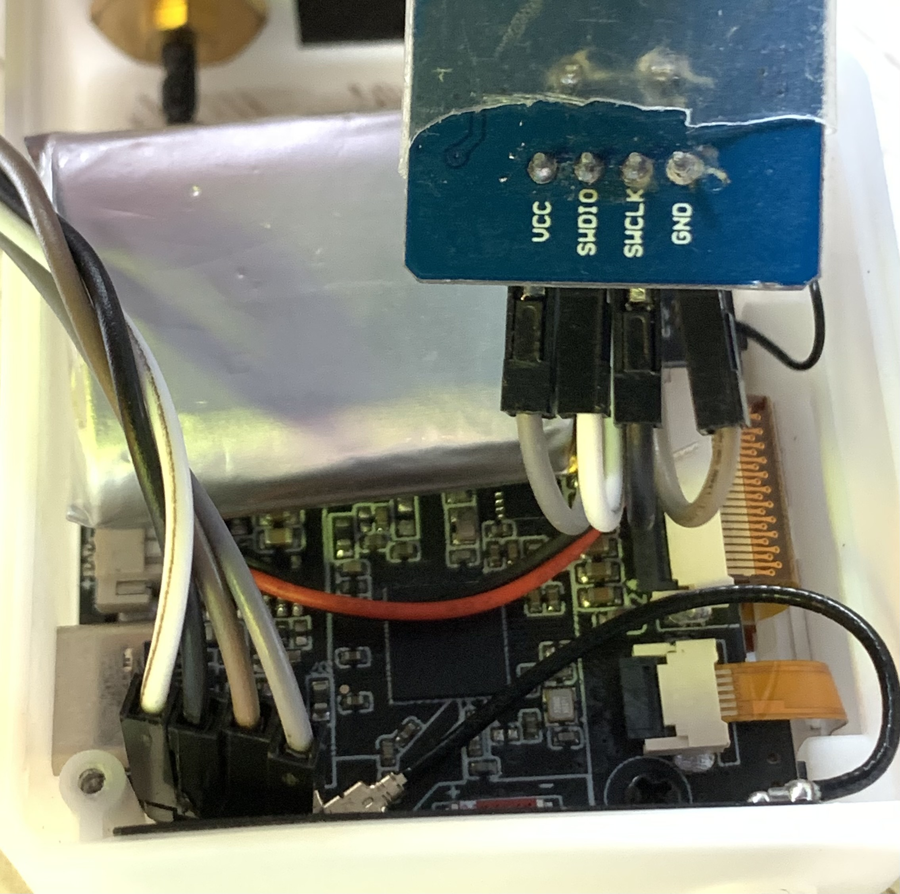
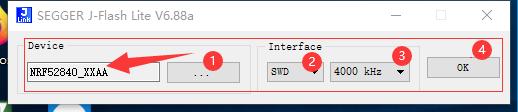
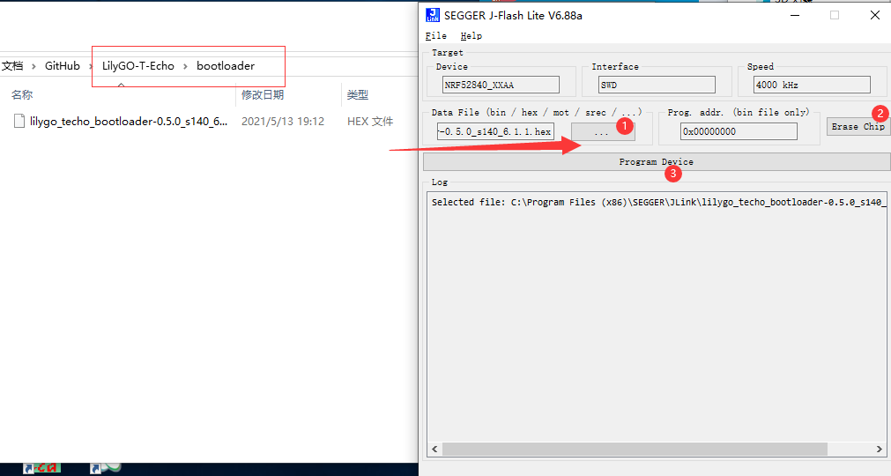

<h1 align = "center">🌟LilyGo T-ECHO🌟</h1>

## Burning boatload

###Use j-Link Flash
1. **If you have downloaded j-Link Flash, you can skip this step. Otherwise, you need to download [J-Link Flash](https://www.segger.com/products/debug-probes/j-link/technology/flash-download/)**
2. **You need to use the SWD interface to connect to the board as shown**

3. **Open J-Flash Lite and select NRF52840_XXAA on the device.The diagram below.**

4. **Erase the chip, and then burn boatload. The diagram below.**

###Use Arduino IDE

1. You need to refer to[Using Arduino IDE](https://github.com/Xinyuan-LilyGO).
2. You need to use`LilyGO-T-Echo/bootloader/lilygo_techo_bootloader-0.5.0_s140_6.1.1. Hex`Replace `Arduino\hardware\Adafruit\Adafruit_nRF52_Arduino\bootloader\ pCA10056`.
3. [Please reference](https://github.com/adafruit/Adafruit_nRF52_Arduino#update-bootloader-with-dfu).

