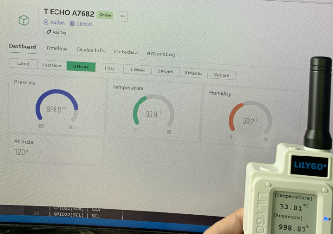

<h1 align = "center">T-ECHO</h1>

# Steps:
1. Need to install the following dependencies
     - [Adafruit BMP085 Library](https://github.com/adafruit/Adafruit-BMP085-Library)
     - [blynk-library](https://github.com/blynkkk/blynk-library)
     - [TinyGSM](https://github.com/vshymanskyy/TinyGSM)

2. Reference[Documentation](https://docs.blynk.io/en/)

